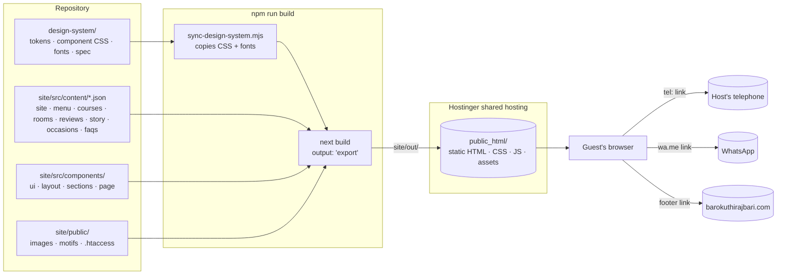
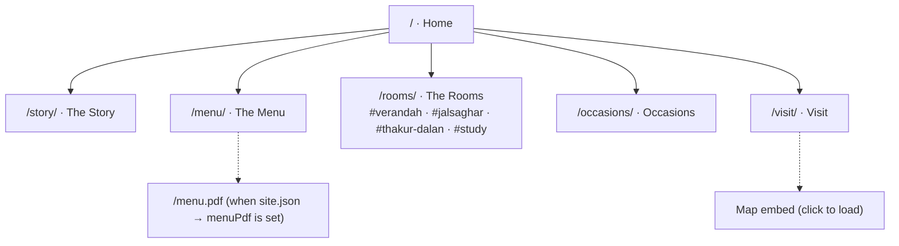
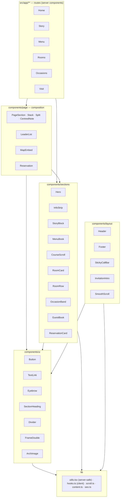
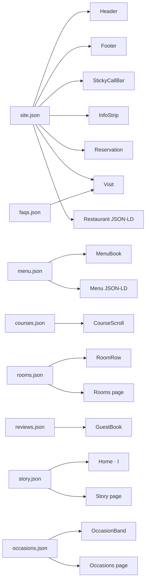
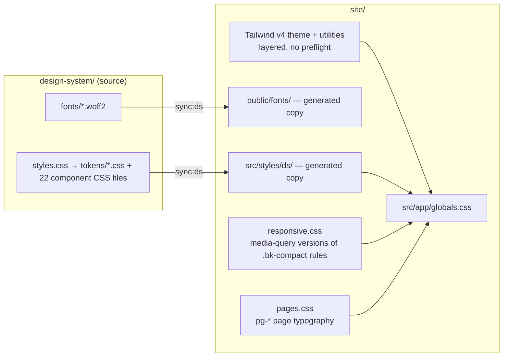
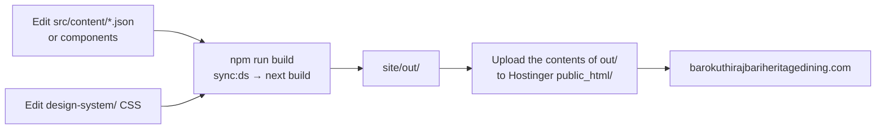
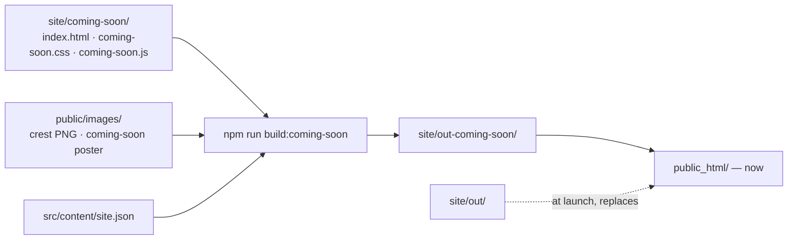

# ARCHITECTURE.md — Baro Kuthi Rajbari · The Heritage Dining

> How the website is put together: repository layout, pages, components, data, styling, behaviour, build and deploy.
> Brand and visual rules live in [`design-system/uploads/DESIGN.md`](../design-system/uploads/DESIGN.md), the source of truth.
> This file covers structure only. If the two disagree, DESIGN.md wins. Update this file when you fix the conflict.

**Domain:** `barokuthirajbariheritagedining.com` (working) · **Sister site:** `barokuthirajbari.com` (Banquet House)
**Booking model:** telephone and WhatsApp only. There is no booking backend, no forms and no database.
**Language:** English only.

---

## 1. System at a glance

The site is a **static, content-driven brochure site**. Every page is prerendered at build time and served as plain
files. The only "conversion" is a `tel:` or `wa.me` link.



| Concern | Choice | Why |
|---|---|---|
| Rendering | Next.js 16 App Router, `output: 'export'`, `trailingSlash: true` | Shared hosting; no server runtime; `/story/` → `story/index.html` works on Apache unchanged |
| Language | TypeScript (strict) | Content JSON is typed, so a missing key fails the build |
| Styling | Design-system CSS (synced) + Tailwind v4 for page layout | Tokens stay the contract; utilities only arrange sections |
| Motion | Native IntersectionObserver / `position: sticky` / CSS (ported from the design system) + Lenis smooth scroll | Everything in §8 without GSAP's weight — see §7 |
| Content | JSON in `site/src/content/` | Owners edit data, not code; no CMS |
| Reviews | Real Google reviews, copied in by hand (or fetched at build time later) | No client-side API keys |
| Booking | `tel:` + `wa.me` deep links | The phone is the hero CTA by design |

---

## 2. Repository layout

```
Baro Kuthi Design System/            ← repository root
├── README.md                        overview + quick start
├── docs/
│   └── ARCHITECTURE.md              this file
├── design-system/                   LAYER 1 — brand source of truth (unchanged internally)
│   ├── uploads/DESIGN.md            the brand spec (v1.0, BizNexa)
│   ├── styles.css · tokens/ · fonts/ · assets/
│   ├── components/                  21 reference components (JSX + .d.ts + .prompt.md + CSS + preview card)
│   ├── guidelines/                  specimen pages
│   ├── ui_kits/website/             click-through prototype (hash routes, Babel in browser)
│   ├── templates/heritage-dining-site/
│   └── _ds_bundle.js · _ds_manifest.json · SKILL.md · readme.md
└── site/                            LAYER 2 — production website
    ├── package.json · next.config.ts · tsconfig.json · postcss.config.mjs
    ├── scripts/sync-design-system.mjs
    ├── public/                      .htaccess · images/ · motifs/ · fonts/ (generated)
    └── src/
        ├── app/                     routes: / · story · menu · rooms · occasions · visit · 404 · sitemap · robots
        ├── components/
        │   ├── ui/                  Button · TextLink · Eyebrow · SectionHeading · Divider · FrameDouble · ArchImage
        │   ├── layout/              Header · Footer · StickyCallBar · InvitationIntro · SmoothScroll
        │   ├── sections/            Hero · InfoStrip · StoryBlock · MenuBook · CourseScroll · RoomCard · RoomRow
        │   │                        OccasionBand · GuestBook · ReservationCard
        │   └── page/                PageSection · Stack · Split · CentredNote · LeaderList · MapEmbed · Reservation
        ├── content/                 *.json + README.md (what is sample, what to replace)
        ├── lib/                     content.ts (types) · utils.tsx · hooks.ts · scroll.ts · seo.ts
        └── styles/                  ds/ (generated) · responsive.css · pages.css
```

The design system was moved into `design-system/` as a whole; nothing inside it changed, so its prototypes, bundle,
templates and relative paths still work (via XAMPP: `http://localhost/Baro%20Kuthi%20Design%20System/design-system/ui_kits/website/`).

**One-way dependency:** `site/` reads from `design-system/` (CSS and fonts, at build time). The design system never
depends on the site.

---

## 3. Information architecture

### 3.1 Sitemap



Header: **The Story · The Menu · The Rooms** | *wordmark* | **Occasions · Visit** + phone.
Generated: `/sitemap.xml`, `/robots.txt`, `/404.html`.

### 3.2 The guest journey (site concept)

```
Invitation → Gate → Courtyard → The Table → The Courses → The Rooms → Occasions → Guest Book → Reservation
```

### 3.3 Universal page frame — `src/app/layout.tsx`

```
┌──────────────────────────────────────────────┐
│ Skip to content (visible on focus)            │
│ Header             sticky · 88px → 64px      │
├──────────────────────────────────────────────┤
│ <main id="main">  page sections …            │
│                   <Reservation/> (always last)│
├──────────────────────────────────────────────┤
│ Footer             terracotta-deep           │
│ StickyCallBar      fixed · < 768px only      │
│ Restaurant JSON-LD                            │
└──────────────────────────────────────────────┘
```

`InvitationIntro` is rendered by the Home page only. Every page ends with `<Reservation />` by convention
(`src/components/page/Reservation.tsx`); Home passes `home` to number it VII.

### 3.4 Page compositions

| Route | File | Sections, top to bottom |
|---|---|---|
| **Home** `/` | `app/page.tsx` | InvitationIntro → Hero → InfoStrip → **I** StoryBlock → Divider → **II** MenuBook (4 a side) → **III** CourseScroll → **IV** RoomRow → **V** OccasionBand → **VI** GuestBook → **VII** Reservation |
| **The Story** | `app/story/page.tsx` | Hero (72svh) → timeline of StoryBlocks (1823 → today, alternating) → Divider → CTA to menu → Reservation |
| **The Menu** | `app/menu/page.tsx` | h1 + MenuBook (full) → set menus (alt) → Verandah café → Divider → seasonal note + PDF → Reservation · `Menu` JSON-LD |
| **The Rooms** | `app/rooms/page.tsx` | h1 → one section per room (`id` = slug; alternating light/alt) with cinema image, prose, leader facts → Reservation |
| **Occasions** | `app/occasions/page.tsx` | h1 → three StoryBlocks → how it works (I–III steps, alt) → Reservation |
| **Visit** | `app/visit/page.tsx` | h1 → MapEmbed + address / hours / getting here → FAQs (alt) → Reservation |
| 404 | `app/not-found.tsx` | h1 → return link → Reservation |

**Rhythm rule:** light and dark bands alternate; two dark bands are never adjacent. Page files must keep this —
components cannot check it.

---

## 4. Component architecture



### 4.1 Inventory

| Tier | Component | Runs on | Spec |
|---|---|---|---|
| ui | `Button` — primary · secondary · on-dark; internal hrefs use `next/link` | server | §9.1 |
| ui | `TextLink` — small caps + `→` | server | §9.1 |
| ui | `Eyebrow` | server | §3 |
| ui | `SectionHeading` — ornament → eyebrow · numeral → title → lead; reveal on scroll | client | §4 |
| ui | `Divider` — railing motif / self-drawing hairline | client | §9.6 |
| ui | `FrameDouble` | server | §5 |
| ui | `ArchImage` — arch · tall · wide · cinema · square; placeholder without `src`; optional parallax | client | §7 |
| layout | `Header` — renders desktop and mobile bars; CSS picks one (switch at 1200px) | client | §9.2 |
| layout | `Footer` | server | §9.14 |
| layout | `StickyCallBar` | server | §9.3 |
| layout | `InvitationIntro` — first visit, 30-day memory, `?intro` replays | client | §9.4 |
| layout | `SmoothScroll` — Lenis; paused while scroll is locked | client | §8 |
| sections | `Hero` — chandelier sway when the motif is supplied | client | §9.5 |
| sections | `InfoStrip` | server | §10 |
| sections | `StoryBlock` | server | §9.7 |
| sections | `MenuBook` — spread ≥ 768px; tabs + page-turn below | client | §9.8 |
| sections | `CourseScroll` — stack in HTML; desktop upgrades to pinned after hydration | client | §9.9 |
| sections | `RoomCard` / `RoomRow` — 4 / 2 columns, swipe + progress line on phones | server / client | §9.10 |
| sections | `OccasionBand` | server | §9.11 |
| sections | `GuestBook` | server | §9.12 |
| sections | `ReservationCard` — alpana line-draw when supplied | client | §9.13 |

### 4.2 Conventions

- **Same props as the design system.** Each `.tsx` follows its `design-system/components/**/Name.d.ts`, minus the
  `layout` prop (see next point). Content always arrives as props from `src/content/`.
- **Responsive by viewport, not by measurement.** In the design system, components measure their own width and add
  `.bk-compact` (so they work inside phone frames on a canvas). A static export cannot measure before JavaScript runs,
  so the site keys the same rules to media queries in `src/styles/responsive.css`. The prerendered HTML is already
  correct on phones: no layout jump at hydration. Where behaviour (not just styling) differs, `useMediaQuery` returns
  `false` during prerender/hydration and the live value after.
- **Server by default.** Only components with state, effects or event handlers carry `'use client'`.
  `lib/utils.tsx` holds server-safe helpers; `lib/hooks.ts` holds client hooks — never mix them in one module.
- **Motif slots.** `crest`, `lalpaar`, `chandelier`, `alpana`, `checker`, `seal`, `shutter`, `icon`, `motif` accept an
  SVG URL (from `public/motifs/`) or an inline SVG node. Until the commissioned art exists each falls back to a plain
  primitive (hairline, solid band, empty arch niche) — never an invented drawing.

---

## 5. Data architecture

All content is data. Components never contain prices, phone numbers, hours, history or reviews.



| File | Shape (summary) |
|---|---|
| `site.json` | `name · shortName · url · description · phone{display,href,e164} · whatsapp · address{lines,short,locality,region,country} · mapHref · mapEmbed · hoursLine · hours[{label,value,opens,closes}] · gettingHere[] · banquetHref · menuPdf · servesCuisine[]` |
| `menu.json` | `currency · tables[{title,tab,subtitle,items[{name,price,description,speciality}]}] · sets · verandah · seasonalNote` |
| `courses.json` | `[{numeral,name,note,image?,imageAlt,icon?}] × 8` |
| `rooms.json` | `[{slug,name,eyebrow,description,image?,imageAlt,capacity,best,occasions,text}] × 4` |
| `reviews.json` | `[{date,quote,name,href,source}]` — real reviews only |
| `story.json` | `homeExcerpt · chapters[{year,title,image?,imageAlt,draft?,quote?,body[]}]` |
| `occasions.json` | `band[{title,text,icon?}] · details[{title,eyebrow,image?,imageAlt,text}] · steps[{numeral,title,text}]` |
| `faqs.json` | `[{q,a}]` |

Types live in `src/lib/content.ts`. **Single sources of truth:** phone / WhatsApp / hours / address only in
`site.json`; prices only in `menu.json`. Which values are still sample data is listed in `src/content/README.md`.

---

## 6. Styling architecture



1. **Tokens** (`--terracotta`, `--fs-h2`, `--section-pad-y` …) come only from the design system. Mobile token values
   already switch by media query in `tokens/*.css`.
2. **Sync, don't fork.** `scripts/sync-design-system.mjs` runs before every `dev` and `build`. It copies each file
   `design-system/styles.css` imports into `src/styles/ds/`, rewrites font URLs to `/fonts/`, and copies the woff2
   files into `public/fonts/`. Both copies are git-ignored. To change a component's look, edit `design-system/`.
   The script updates files in place and never deletes the folders: if a running `next dev` sees them vanish,
   Turbopack caches the failure in `.next/` ("Can't resolve '../styles/ds/index.css'") until that cache is cleared.
3. **Tailwind v4, CSS-first.** `globals.css` imports Tailwind's theme and utilities into cascade layers (no preflight)
   and maps the DESIGN.md §13 theme onto the design-system variables with `@theme inline` (brand colours only,
   `sm 480 · md 768 · lg 1024 · xl 1280 · 2xl 1536`). Unlayered design-system CSS always beats utilities.
   **Convention:** utilities arrange page sections (grids, stacks, gaps); `bk-*` classes style components;
   `pg-*` classes in `pages.css` style page-level typography.
4. **Responsive overrides** (`responsive.css`) mirror every `.bk-compact`, `--mid` and `--swipe` rule as media
   queries. Keep them in step when design-system component CSS changes.

**Hard constraints:** radius 0 except arches and round seals/dots; no shadow except the open menu book; Cinzel,
Cormorant Garamond, and Playfair Display for header navigation only; copper never as text on parchment.

---

## 7. Behaviour and motion

| Behaviour | Where | Mechanism | Reduced motion |
|---|---|---|---|
| Smooth scroll | Global | Lenis (`lerp 0.08`); off on touch devices; paused while `<html>` is scroll-locked | Off |
| Programmatic scroll | Course dots | `lib/scroll.ts` → `lenis.scrollTo` (native smooth scroll fights Lenis) | Instant |
| Reveal (fade + 24px, once) | SectionHeading | IntersectionObserver → `data-reveal` | Final state at once |
| Header condense | Header | scroll listener, 120px | Kept |
| Shutter open | InvitationIntro | CSS transitions | Skipped (intro not shown) |
| Page turn | MenuBook tabs (< 768px) | CSS keyframes, replayed by remounting the page | Instant swap |
| Pinned course sequence | CourseScroll | `position: sticky` stage + scroll progress | Vertical stack |
| Line draw | Divider, alpana | `stroke-dashoffset` / `scaleX` via `useDrawOnView` | Drawn at once |
| Chandelier sway ±1.5° | Hero (when motif supplied) | scroll velocity | Off |
| Parallax ≤ 8% | ArchImage (`parallax`) | rAF on scroll | Off |

**No GSAP.** The spec lists GSAP + ScrollTrigger; the design system already implements every allowed motion with
native APIs, so the site does too and stays smaller. Add GSAP only if a future effect truly needs it, and only on
the route that uses it.

**Client state:** invitation seen (`localStorage`, try/catch, 30 days); mobile menu open (focus moves in, Esc closes,
focus returns, scroll locked); active menu tab / course / room-swipe position (not persisted).

---

## 8. Cross-cutting requirements

### Performance
- Every route is static HTML; fonts self-hosted with the two above-the-fold faces preloaded.
- Images: WebP/AVIF, hero ≤ 350KB, others ≤ 200KB, max width 2000px, explicit `width`/`height`, lazy below the hero.
- Map embed loads only on click.
- **JavaScript budget (§12: ≤ 150KB gzipped) — measured at first build:** Home ships ≈ 186KB gzipped, of which
  ≈ 175KB is the Next.js 16 + React 19 runtime and ≈ 10KB is site code (components + Lenis). The budget cannot be met
  with the Next.js App Router itself; it would need a lighter framework (e.g. Astro with islands). Decision for the
  owners/BizNexa: accept the framework baseline or change the stack.

### Accessibility
- WCAG 2.1 AA contrast pairs per DESIGN.md §2. Skip link; one `<h1>` per page; landmark regions.
- Every control keyboard reachable; copper focus ring always visible; touch targets ≥ 48px.
- `prefers-reduced-motion` gives a complete, animation-free site.
- Known tensions (from the design system): copper menu-icon lines on parchment (1.9:1); small-caps eyebrow/button sizes.

### SEO
- Per-page `title`, `description`, canonical URL and Open Graph (`lib/seo.ts`).
- JSON-LD: `Restaurant` on every page (from `site.json`), `Menu` on `/menu/` (from `menu.json`).
- `sitemap.xml` and `robots.txt` generated at build.

### Security and privacy
- No forms, accounts, cookies or server code. Static files only.
- `.htaccess` forces HTTPS and sets `nosniff`, `Referrer-Policy`, `X-Frame-Options`, `Permissions-Policy`.
- No third-party requests until the guest clicks "Load the Map".

---

## 9. Build and deployment



```
cd site
npm install          # once
npm run dev          # http://localhost:3000 (syncs the design system first)
npm run typecheck
npm run build        # writes out/
```

- `public/.htaccess` ships inside `out/`: HTTPS redirect, `/story` → `/story/`, `ErrorDocument 404 /404.html`,
  security headers, a year's cache for hashed `/_next/static` files, 30 days for fonts and images, none for HTML.
- Content changes mean rebuild and re-upload. There is no runtime CMS.

### Auto-deploy (GitHub Actions → Hostinger)

`.github/workflows/deploy.yml` runs on every push to `main`: `npm ci` → type-check → `npm run build` → (Coming Soon
mode) `build:coming-soon` + `scripts/protect-preview.mjs` → FTPS upload with SamKirkland/FTP-Deploy-Action (changed
files only; files it uploaded earlier and that no longer exist are removed).

| `SITE_MODE` variable | Public domain | Preview subdomain |
|---|---|---|
| `coming-soon` (default) | `out-coming-soon/` — every path → Coming Soon | `out/` + HTTP Basic Auth + noindex |
| `live` | `out/` — the full website | untouched |

Launch = change `SITE_MODE` to `live` and re-run; no code change. Credentials live only in GitHub secrets.
Setup steps: `site/README.md` → Auto-deploy.

### Favicon (both builds)

One source: `site/public/images/favicon.svg` (client-supplied). `scripts/build-icons.mjs` copies it and derives
`favicon-32/48.png`, `apple-touch-icon.png` (180), `icon-192/512.png` — rasterised from the JPEG embedded in the
SVG, so they are sharp and free of the SVG's thin white edge. It runs before every `dev`/`build` (into `public/icons/`,
git-ignored) and inside `build-coming-soon` (into `out-coming-soon/icons/`). The main site links them through `metadata.icons`
in `app/layout.tsx` and `app/manifest.ts`; both `.htaccess` files answer `/favicon.ico` with the 48px PNG.
To change the icon anywhere, replace that one file and rebuild.

### Pre-launch: Coming Soon

Until launch, the domain serves a **separate static build**, not the Next.js app:



- **Why separate:** gating inside the app would still upload every unfinished page (`/menu/` etc.). This way the
  server only ever holds the Coming Soon page; its `.htaccess` redirects every other path to `/`.
- **Build:** `scripts/build-coming-soon.mjs` trims the crest and resizes it to a 1300px WebP, reuses the shared favicon pipeline (`scripts/build-icons.mjs`), makes a 1200×630 share image, copies the latin brand fonts and Noto Serif Bengali (for the tagline), and
  content-hashes the CSS/JS names. Name, URL and contact links come from `site.json`; the contact links are omitted
  while the numbers are still placeholders.
- **Loader:** a hairline fanlight is drawn exactly over the arch in the crest, lamplight fills it, the crest
  blooms outward from it with one gilt sheen, then two khorkhori shutter panels part. Progress reflects real asset
  loading (min 3.4s, max 8s). It plays once per session and never under reduced motion; without JavaScript the
  finished page shows immediately.
- **Page:** the stamp settles in, the rule draws, "Coming Soon" settles from wide tracking, gold dust drifts through
  the candle-light, the fanlight rays sway slowly, and the stamp tilts ≤ 3° towards the pointer (desktop only).
- **Launch:** empty `public_html/`, upload `out/`. Nothing in the app references the Coming Soon files.

---

## 10. Open items before launch

| Item | Status | Where it goes |
|---|---|---|
| Logo / crest, motif SVGs, Bishnupur terracotta icons | Not supplied; fallbacks in place | `public/motifs/` → motif props |
| Photography (graded dusk set) | Not supplied; labelled placeholders | `public/images/` → `image` fields in content JSON |
| Real phone and WhatsApp numbers | `XXXXXXXXXX` placeholders | `site.json` |
| Menu, prices, room capacities, hours, getting here | Illustrative sample data | `menu.json`, `rooms.json`, `site.json` |
| History chapters (1823, 1858, 1859) | Drafts; owners must verify | `story.json` |
| Guest-book reviews | Placeholders; must be real | `reviews.json` |
| Menu PDF | Not supplied; button hidden | `public/menu.pdf` + `site.json` → `menuPdf` |
| Favicon / app icons | ✓ Supplied — `public/images/favicon.svg` (full logo; illegible at 32px — a monogram-only version would read better in browser tabs) | `public/images/favicon.svg` |
| JS budget decision | Framework baseline exceeds §12 | §8 above |

See DESIGN.md §16 for the full pre-launch checklist.
